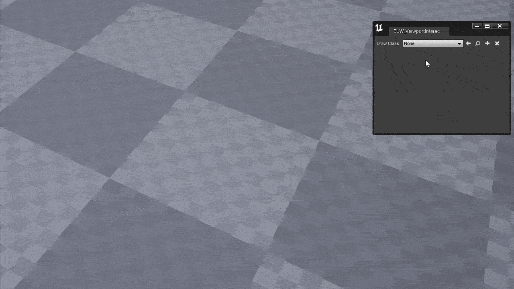
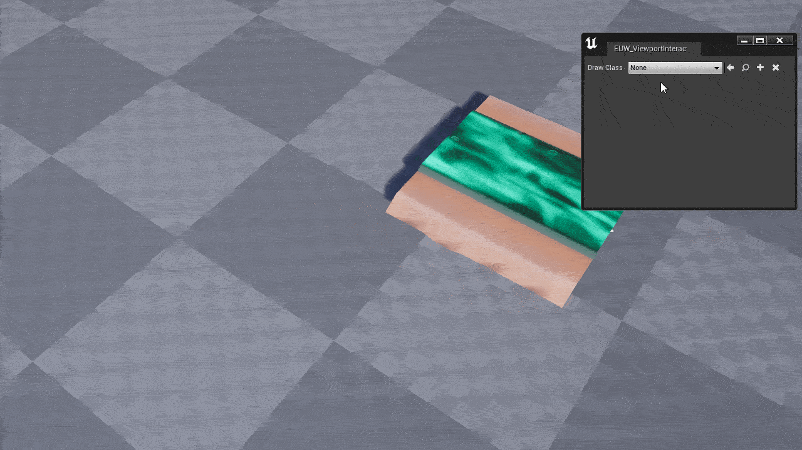

# Viewport Scripting Utilities

A set of classes and methods that allow a Blueprint user to build Viewport tools using the underlying ViewportWorldInteraction module.

## Example Implementation

### Editor Utility Widget

`/ViewportScriptingUtilities/Editor/EUW_ViewportInteraction` contains an example editor utility widget that sets up the viewport interactors.

### Cursor Interactors

Included examples of cursor interactor implementations:

- `/ViewportScriptingUtilities/Editor/GreasePencil`: Draws a bunch of debug points to simulate a temporary grease pencil.\

- `/ViewportScriptingUtilities/Editor/SplineDraw`: If an actor with a spline is selected, will allow the user to hold the `CTRL` key and click to place spline points on the surface under the mouse cursor.\
